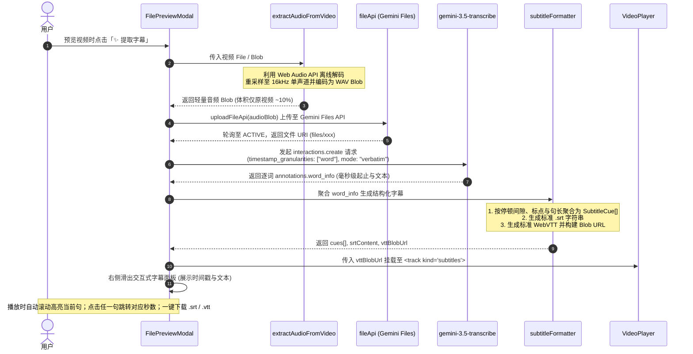

# 基于 Gemini 3.5 Transcribe 的视频字幕识别与导出架构设计

日期：2026-09-18  
范围：`src/utils/video-subtitles/`（音频抽取、转写服务、字幕生成）、`src/components/shared/file-preview/`（播放器字幕轨挂载）、`src/components/modals/`（预览弹窗交互联动）、i18n 翻译与测试  
状态：设计完成，进入评审

---

## 1. 背景与目标

当前 AMC-WebUI 已具备完善的媒体文件处理与视频播放基础设施：

- 支持视频文件上传、预览播放（[`VideoPlayer`](file:///Volumes/WD_BLACK/Code/AMC-WebUI/src/components/shared/file-preview/VideoPlayer.tsx)）、时间点跳转（Seek）以及全屏/悬浮预览（[`FilePreviewModal`](file:///Volumes/WD_BLACK/Code/AMC-WebUI/src/components/modals/FilePreviewModal.tsx)）；
- 具备与 Google Gemini Files API 的断点分片续传能力（`uploadFileApi`）与客户端上下文管理。

但在视频内容理解与二次消费场景下，用户仍缺乏直接从导入的视频中提取字幕、实时对照播放以及导出字幕文件的能力。

Google 官方最新推出的专用语音转写大模型 **`gemini-3.5-transcribe`** 提供了极高精度的 ASR 能力，具备以下关键特性：

1. **词级高精时间戳**（`timestamp_granularities: ["word"]`）：提供精确到毫秒级的底层声学对齐（`start_offset` 与 `end_offset`），彻底杜绝生成式大模型的时间轴漂移；
2. **说话人分离**（`diarization_mode: "speaker"`）：自动识别区分不同发言人（最高 8 人）；
3. **多语种自动检测**：覆盖 85+ 种语言并支持语内混杂；
4. **性价比与速度**：作为专用转写模型，推理极速且专为语音设计。

**设计目标**：

1. **极速轻量传输**：纯前端（浏览器 Web Audio API）秒级提取视频音轨为 16kHz WAV 音频，体积缩减 90%，避免上传巨大视频文件，零服务器转码负担；
2. **硬件级精准对齐与智能断句**：调用 `gemini-3.5-transcribe` 获得逐词时间戳，并在前端按照自然停顿、语义标点及长度阈值聚合成标准字幕行；
3. **无缝播放器联动**：提取后实时生成 WebVTT 并作为 `<track>` 挂载至播放器画面；同时在右侧展开交互式时间戳抽屉，支持随视频播放高亮及点击任意句瞬时跳转（Seek）；
4. **标准格式导出**：提供一键下载 `.srt`（SubRip 通用字幕文件）与 `.vtt`（网页原生字幕）及纯文本复制。

---

## 2. 系统整体架构与数据链路



---

## 3. 核心模块详细设计

### 3.1 浏览器端轻量音频抽取（`src/utils/video-subtitles/extractAudioFromVideo.ts`）

由于 `gemini-3.5-transcribe` 是专属音频转写模型（接受 `audio/wav`, `audio/mp3` 等，不直接接收视频容器），且视频中的画面数据占 90% 以上体积，在客户端秒级离线提取音频是最佳实践：

```typescript
export interface AudioExtractionResult {
  audioBlob: Blob;
  durationSeconds: number;
}

/**
 * 利用浏览器 Web Audio API 从视频 File / Blob 中离线解码音轨，
 * 转换为 16kHz、单声道、16-bit PCM 的标准 WAV 文件。
 */
export async function extractAudioFromVideo(videoBlob: Blob, signal?: AbortSignal): Promise<AudioExtractionResult>;
```

- **实现要点**：
  1. 使用 `videoBlob.arrayBuffer()` 读取二进制数据；
  2. 使用 `AudioContext.decodeAudioData()` 快速硬件解码；若音频轨道为空，抛出 `NO_AUDIO_TRACK` 语义错误；
  3. 将各声道混音/降采样为 16000Hz 单声道（ASR 最佳参数），写入标准 44 字节 WAV 文件头及 PCM 采样块；
  4. 生成 `audio/wav` 类型的轻量 Blob。

---

### 3.2 Gemini 转写调用服务（`src/utils/video-subtitles/geminiTranscribeService.ts`）

```typescript
export interface WordAnnotation {
  text: string;
  start_offset: string; // 例如 "1.200s"
  end_offset: string; // 例如 "1.550s"
  speaker?: string; // 例如 "spk_1"
}

export async function transcribeAudioWithGemini(
  apiKey: string,
  audioBlob: Blob,
  fileName: string,
  signal: AbortSignal,
  onProgress?: (phase: 'uploading' | 'transcribing', progress?: number) => void,
): Promise<WordAnnotation[]>;
```

- **调用参数配置**：
  ```typescript
  const interaction = await client.interactions.create({
    model: 'gemini-3.5-transcribe',
    input: [
      {
        type: 'audio',
        uri: uploadedFile.uri,
        mime_type: 'audio/wav',
      },
    ],
    generation_config: {
      transcription_config: {
        mode: {
          type: 'verbatim',
          timestamp_granularities: ['word'],
        },
      },
    },
  });
  ```
- **输出解析**：深度遍历 `interaction.steps` -> `content` -> `annotations`，提取所有 `type === "word_info"` 的词条。

---

### 3.3 智能断句聚合与格式化引擎（`src/utils/video-subtitles/subtitleFormatter.ts`）

将分散的逐词时间戳聚合成人类观看视频时舒适阅读的字幕单行（Cues）：

```typescript
export interface SubtitleCue {
  id: number; // 1, 2, 3...
  startSeconds: number; // 12.35
  endSeconds: number; // 15.80
  startTimeSrt: string; // "00:00:12,350"
  endTimeSrt: string; // "00:00:15,800"
  startTimeVtt: string; // "00:00:12.350"
  endTimeVtt: string; // "00:00:15.800"
  text: string; // "合并后的整行文字"
  speaker?: string;
}

export function groupWordsIntoCues(words: WordAnnotation[]): SubtitleCue[];
export function generateSrtContent(cues: SubtitleCue[]): string;
export function generateVttContent(cues: SubtitleCue[]): string;
export function downloadTextFile(filename: string, content: string, mimeType: string): void;
```

- **断句逻辑约束**：
  1. **停顿切句**：相邻两个词的时间间隙 `(word[i].start - word[i-1].end) > 0.45s`；
  2. **标点切句**：词尾字符包含强终止标点（`.`、`?`、`!`、`。`、`？`、`！`）；
  3. **字符数限制**：单行中文字符达到 18~~22 字，或英文字母达到 60~~70 个字符时，在最近的弱标点或空格处切句；
  4. **时长限制**：单条字幕时长不超过 5.5 秒。

- **SRT 与 WebVTT 格式标准**：
  - SRT 时间戳格式：`HH:MM:SS,mmm`（以逗号分隔毫秒）
  - VTT 时间戳格式：`HH:MM:SS.mmm`（以点号分隔毫秒，顶部包含 `WEBVTT` 头部）

---

### 3.4 视频播放器原生字幕挂载（`src/components/shared/file-preview/VideoPlayer.tsx`）

在 `VideoPlayerProps` 中扩展 `subtitlesSrc?: string`（传入 VTT Blob URL）：

```tsx
<video
  ref={logic.videoRef}
  ...
>
  {subtitlesSrc && (
    <track
      key={subtitlesSrc}
      kind="subtitles"
      src={subtitlesSrc}
      srcLang="zh"
      label="Subtitles"
      default
    />
  )}
</video>
```

浏览器原生即刻在视频画面的居中底部渲染高对比度字幕。

---

### 3.5 视频预览弹窗联动与交互抽屉（`FilePreviewModal.tsx` & `VideoSubtitlesDrawer.tsx`）

- **触发入口**：在视频顶部控制条新增按钮 `✨ 提取字幕`（多语言键 `extractSubtitles`）。
- **状态流转**：
  - 空闲状态：`✨ 提取字幕`
  - 抽取音频中：`正在抽取音频...`
  - 上传音频中：`上传音频中 ${percent}%`
  - 模型转写中：`Gemini 3.5 正在精准对齐...`
  - 完成状态：右侧展开抽屉，按钮变为 `字幕已就绪 (重新提取)`
- **右侧抽屉面板（`VideoSubtitlesDrawer`）**：
  - **顶部工具条**：
    - `下载 SRT`（保存为 `[原视频名].srt`）
    - `下载 VTT`（保存为 `[原视频名].vtt`）
    - `复制纯文本`
    - 关闭/收起抽屉按钮
  - **时间轴列表（Virtual/Smooth Scroll）**：
    - 每一项显示：起止时间戳（如 `00:12`）与对应的字幕文本。
    - **播放跟随高亮**：监听播放器的 `currentTime`，实时高亮当前处于播放区间的字幕条目，并平滑滚动到视口中央。
    - **点击跳转（Seek & Play）**：用户点击列表中的某一条字幕，播放器瞬间 `currentTime = cue.startSeconds` 并继续播放。

---

## 4. 异常处理与边界防御

1. **静音视频/无音轨视频**：
   - 在 `extractAudioFromVideo` 阶段若捕获到通道数为 0 或音轨空，提前终止并友好提示：“该视频未包含音轨，无法提取字幕”。
2. **API 鉴权与配置**：
   - 提取前检查是否已配置有效的 Gemini API Key，未配置时弹出设置指引。
3. **时长与超限保护**：
   - `gemini-3.5-transcribe` 在带词级时间戳时单次音频支持最长 30 分钟。若视频超出 30 分钟，前端提前提示时间上限。
4. **内存与 Blob URL 释放**：
   - 在组件卸载或用户关闭预览时，主动调用 `URL.revokeObjectURL(vttBlobUrl)` 释放浏览器内存。

---

## 5. 测试与验证策略

采用严密的 TDD 流程：

1. **音频抽取测试（`extractAudioFromVideo.test.ts`）**：
   - Mock Web Audio API，验证音轨解码、重采样以及标准 44 字节 WAV 头的二进制格式正确性；验证无音轨情况下的异常拦截。
2. **断句聚合与格式化测试（`subtitleFormatter.test.ts`）**：
   - 单元测试覆盖不同停顿间隙、标点符号、超长行断句等多种边界用例；
   - 验证生成的 `.srt` 编号递增、毫秒逗号格式以及内容合法性；
   - 验证生成的 `.vtt` 首行 `WEBVTT` 标记与点号格式。
3. **服务层测试（`geminiTranscribeService.test.ts`）**：
   - Mock `interactions.create` 与 `files.upload`，验证请求 payload 与 `annotations.word_info` 解析的容错性。
4. **组件测试（`VideoPlayer.test.tsx` & `FilePreviewModal.test.tsx`）**：
   - 测试播放器渲染 `<track>` 属性；
   - 测试点击字幕条目的跳转（Seek）回调及导出文件的事件触发。

---

## 6. i18n 国际化设计

在 `src/i18n/translations/` 中补充对应的中英多语言字典：

- `extractSubtitles`: "提取字幕" / "Extract Subtitles"
- `extractingAudio`: "正在抽取音频..." / "Extracting audio..."
- `uploadingAudio`: "正在上传音频..." / "Uploading audio..."
- `transcribingSubtitles`: "Gemini 3.5 正在对齐转写..." / "Transcribing with Gemini 3.5..."
- `downloadSrt`: "下载 SRT" / "Download SRT"
- `downloadVtt`: "下载 VTT" / "Download VTT"
- `copySubtitleText`: "复制文本" / "Copy Text"
- `noAudioTrackDetected`: "视频未检测到音轨，无法生成字幕" / "No audio track detected in this video"
